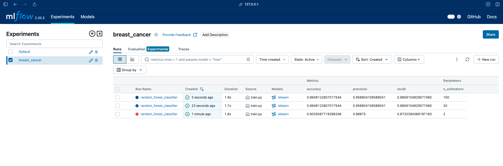
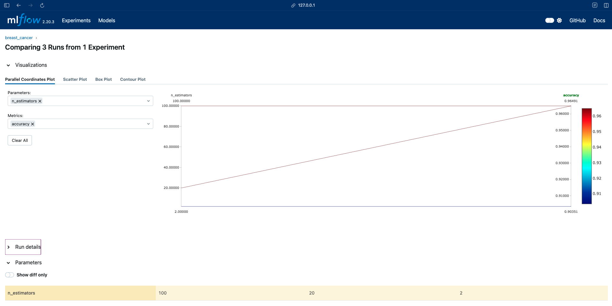

# FastAPI Machine Learning Project

## Overview

This is simple project i created for trying to use MLflow. The project consists of:

- A **FastAPI app** to serve predictions.
- A **MLflow** for monitoring experiment tracking.
- A **training script** to build and update the model.
- A **Makefile** for automation.

## Installation

To set up the project, ensure you have Python installed. Clone the repository, navigate to project directory, create virutal enviroment and activate it:

```sh
python -m venv venv
source venv/bin/activate
```

## Automation with Makefile

The `Makefile` contains commands for automation:

```sh
make install    # Install requirements
make lint       # Run code linting
make format     # Run code formatting
make train      # Train the model
make run        # Start FastAPI app
```

## Usage

### Training the Model

To train the model, run:

```sh
make train
```

This will generate a trained model file.

### Running the MLflow UI

Start the MLflow UI with:

```sh
mlfow ui
```

The UI will be available at `http://localhost:5000`.

You can experiment with the model parameters and retraining it, then new results will be visible in UI.

Below you can see results of my experiments:




### Running the FastAPI App

After training you can start FastAPI application, it will use best model by accuracy. Start the FastAPI application with:

```sh
make run
```

The API will be available at `http://localhost:8000`.


## API Endpoints

- `GET /` - Health check endpoint.
- `GET /docs` - For retrieving documentation
- `POST /predict` - Make predictions using the trained model.

## Example prediction
```sh
curl -X POST -H "Content-Type: application/json" \
     -d '{"data":[9.029,17.33,58.79,250.5,0.1066,0.1413,0.313,0.04375,0.2111,0.08046,0.3274,1.194,1.885,17.67,0.009549,0.08606,0.3038,0.03322,0.04197,0.009559,10.31,22.65,65.5,324.7,0.1482,0.4365,1.252,0.175,0.4228,0.1175]}' \
     http://localhost:8000/predict
```
